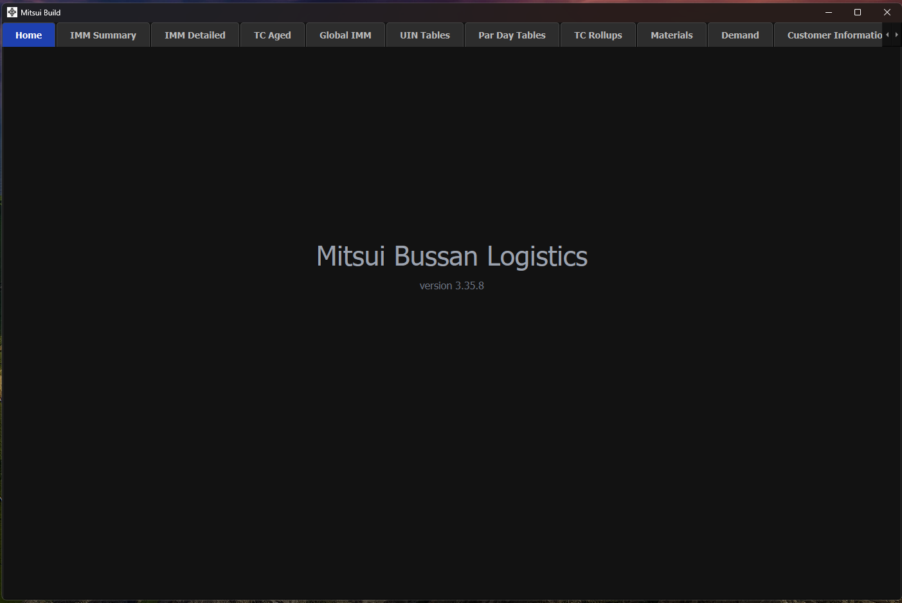

# Supply Chain Dashboard

A full-featured **PySide6 / PyQt6** desktop application developed to provide real-time visibility and analytics for supply chain operations.

## Overview

This internal tool was built to consolidate multiple data sources into a single, user-friendly desktop interface for procurement, inventory, and demand planning teams.

## Key Features

- Multi-tab analytical interface (Summary, Detailed Views, Aged Analysis, Materials, Demand, etc.)
- Interactive Customer Location Map with detailed information pop-ups
- Configurable data source management
- Excel export functionality from all table views
- Real-time data refresh capabilities

## Technologies Used

- **Frontend**: PySide6 / PyQt6 (Python GUI framework)
- **Data Processing**: pandas, openpyxl
- **Visualization**: Custom Qt tables + Leaflet map integration
- **Architecture**: Model-View architecture with background threading for responsive UI

## Business Impact

- Significantly improved supply chain visibility across hundreds of materials
- Reduced manual work by consolidating disparate Excel-based processes
- Enabled faster, data-driven decision making for planning and procurement teams

## Note

This repository is for demonstration purposes only. Due to the proprietary nature of the original internal tool:
- Source code is not included
- Some business-specific logic and data have been redacted
- Screenshots show representative functionality

## Skills Demonstrated

- Full lifecycle desktop application development
- Complex data integration and ETL processes
- Building intuitive user interfaces for technical and non-technical users
- Supply chain systems thinking and domain knowledge

---

**Made using Python**
