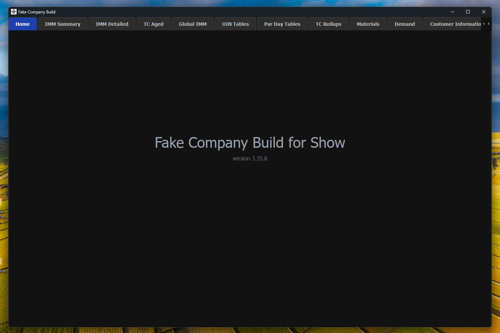
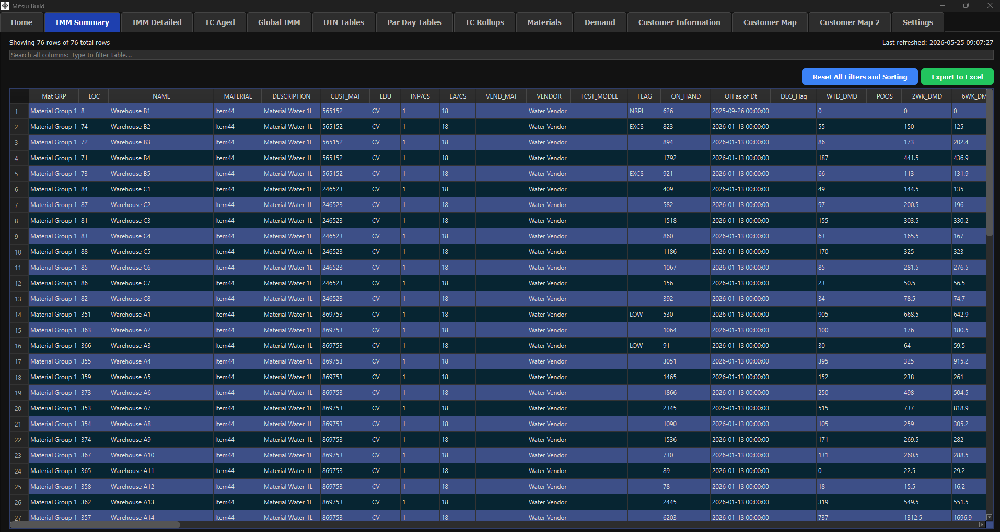
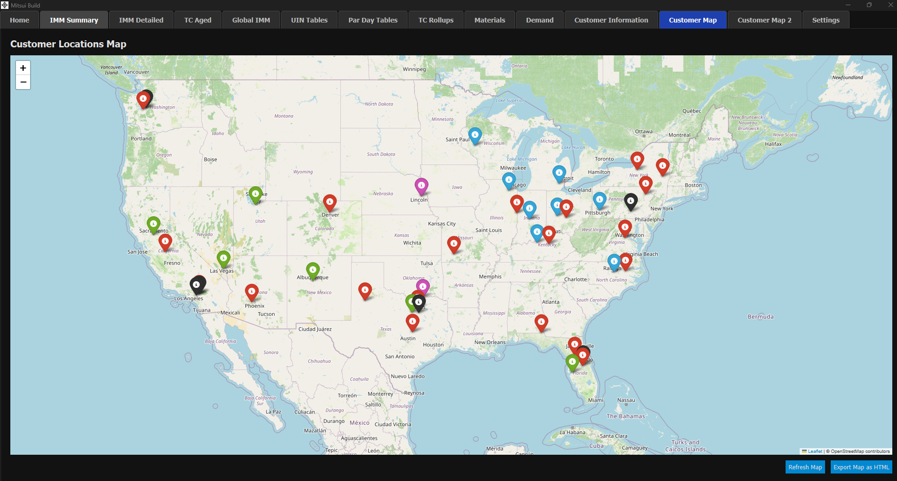
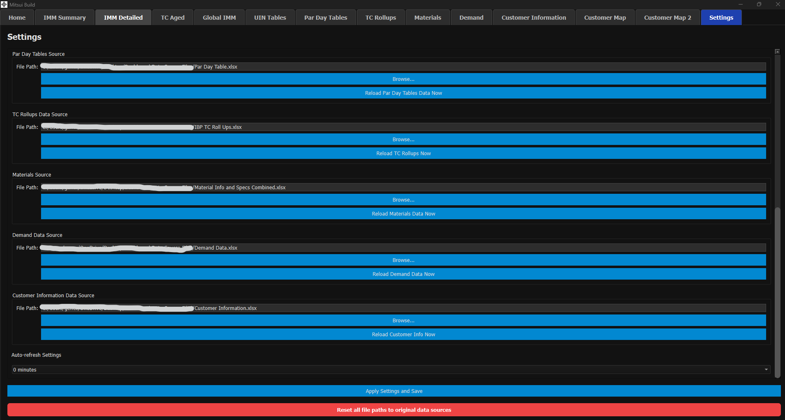
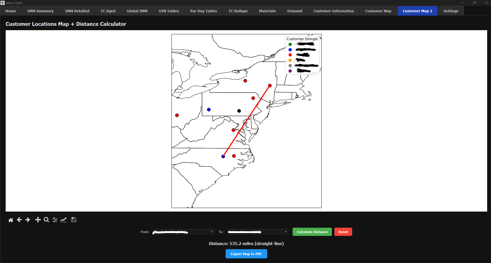

# Supply Chain Dashboard

A full-featured **PySide6 / PyQt6** desktop application built to provide real-time visibility and analytics for supply chain and inventory data.

## Overview

This internal tool was built to consolidate multiple Excel data sources into a single, professional **PySide6 desktop application** that provides real-time visibility and advanced analytics for procurement, inventory management, and demand planning teams.

## Key Features

- **Multi-Tab Analytical Interface** - Inventory Summary, Inventory Detailed, Inventory Aged, Customer Information, Demand Data, and more
- **High-Performance Data Handling** - Optimized for large datasets (500,000+ rows) using a combination of **pandas** and **numpy** for fast filtering, sorting, and aggregation
- **Advanced Table Interactions**:
  - Global search across all columns
  - Right-click column header filtering with custom dialog
  - One-click Excel export and full reset functionality
- **Interactive Demand Analytics**:
  - Multi-select material and location filtering (including "All Locations")
  - Dynamic time-based filtering (Year + Current Period)
  - Custom charting with smooth pastel lines and accurate week-date x-axis
- **Customer Maps**:
  - **Primary**: Interactive Leaflet-based map (Folium) with marker clustering and rich pop-ups
  - **Optional Fallback**: Custom Matplotlib + Cartopy map with distance calculator (used when Folium is restricted by company policy)
- **Settings Panel** - Easy configuration of data sources, auto-refresh intervals, and persistent user settings

## Screenshots

**[NOTE: Data shown is simulated/faked or blocked out to protect company data integrity]**

## Technical Architecture

- **GUI Framework**: PySide6 / PyQt6 with Model-View architecture
- **Data Layer**:
  - `pandas` for core data manipulation and table models
  - `numpy` for performance-critical operations on large datasets (500k+ rows)
  - Custom `BasePandasTableModel` for consistent behavior across all table views
- **Backend Automation**:
  - Multiple autonomous Python scripts that maintain and update data sources
  - Automated ETL processes for pulling, transforming, and refreshing data from multiple Excel files
  - Support for **UAT (User Acceptance Testing)** processes during system updates and migrations
- **Performance Optimizations**: Efficient data caching, background threading for non-blocking UI, and optimized filtering logic
- **Visualization**:
  - Advanced Qt table views with global search and column filtering
  - Interactive multi-series demand charts
  - **Dual Customer Map implementations**:
    - Primary: Folium + Leaflet.js (HTML/JavaScript/CSS)
    - Fallback: Matplotlib + Cartopy with Haversine distance calculator
- **Configuration Management**: Hybrid system using `user_settings.json` (user overrides) and `data_sources.ini` (defaults)

## Technologies Used

- **Core**: Python, PySide6, pandas, numpy, openpyxl
- **Geospatial**: Folium (Leaflet.js), Matplotlib, Cartopy
- **Automation**: Custom ETL scripts, background threading
- **Other**: JSON configuration, Excel integration, Haversine formula

## Business Impact

Developed to replace fragmented Excel workflows with a single, professional-grade desktop tool - significantly improving data visibility, analysis speed, and decision-making for procurement and planning teams.

## Note

This repository is a **demonstration** of the UI, architecture, and capabilities of an internal tool I designed and developed.  
Due to the proprietary nature of the business logic and data, the full source code is not publicly available.

---

**Made using Python**
